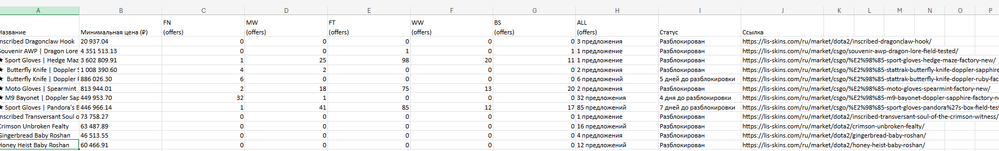

#   Cкрипт для парсинга скинов и генерации XLSX таблиц

## 

 ## **🌐 Язык: [Русский](README.md) | 🌐 Language: [English](README-EN.md)**

⚠️ **Warning:** lis-byer не получает информацию о ваших браузерах, cookie, ссесиях. Скрипт использует предустановленые браузеры для работы playwright, автоматически создавая новую ссесию при запуске.

🦊 **Lis-Byer** скрипт для автоматизаци заполнения xlsx таблиц на тему покупки скинов в таких играх как: СS2, DOTA2, RUST, использующий как источник получения информации популярный и проверенный маркет скинов [Lis-Skins](https://lis-skins.com/ru/blog/)

## ⚙️ Как работать?

• Скачайте актуальный релиз [Realese-v2.0.1](https://github.com/ifuckingjoke/lis-byer/releases)

• Запустите исполняемый файл  `lis-byer.exe`, после чего перейдите в созданный каталог `data` и добавьте ссылки на скины в файл `data.txt` / или содайте нужные каталоги вручную перед запуском исполняемого файла: `books` для сгенерированных таблиц и `data/data.txt`, после добавьте нужные ссылки

• Запустите исполняемый файл `lis-byer.exe`

После анализа всех ссылок скрипт сгенерирут таблицу:

Данный скрипт будет полезен для трейдеров, больших закупов скинов, различных проверок и отчётов или создания проектов на свободную тему с xlsx таблицами

## ⚖️ Лицензия

Лицензия MIT. Подробнее с лицензией можно ознакомиться в файле лицензии - [MIT](LICENSE)

## 📕 Контакты

